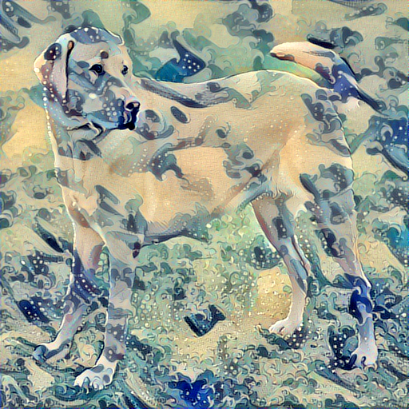

[](https://www.python.org/)

[](https://www.python.org/downloads/release/python-360/) 

# Neural Style Transfer
   CNN based project which transfers a style to desired image. There are two inputs to this model, first is the Style Image(we need the style or maybe even called patterns of this image) and second is the Content Image(the image on which we want to apply the style to). The main concept is that a pre-trained neural network, in this case it is the VGG16, is used to extract the style features of the style image and the content features of the content image and create a new image which has the style of the former and the content or details of the latter. 
   When we pass an image into a network, the Convolutional Layers present in it are responsible for extracting the details out of the image. We use this feature to extract the details out of the two input images and optimize the new image with random pixel values to get the desired output by using L-BFGS-B algorithm for optimization.
   


Content Image


Style Image


Final Output




## Dependencies
```bash
numpy
pillow
keras
scipy
```

## Instructions to Use

Step 1: Clone the repository
```bash
$ git clone https://github.com/Shobhit2000/Neural-Style-Transfer.git
```
Step 2: Open the code, if you want to run the program with same images, then run the program otherwise you can change the image path in the program

Feel free to change the weights of the content, style weights to match your needs. The values of the weights are completely arbitrary.

## Author
[](https://www.linkedin.com/in/shobhit-tulshain-a7562916b/)

* [**Shobhit Tulshain**](https://github.com/Shobhit2000)
